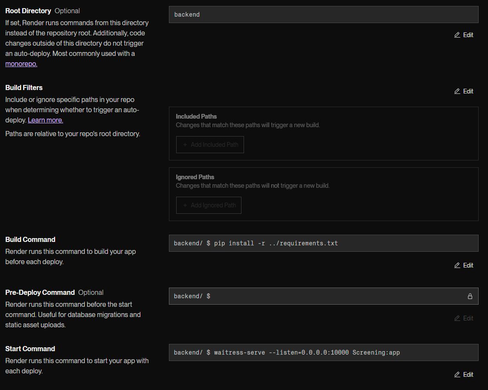

# Screening Master

## Running Instructions

1. **Open a terminal**:

2. **Clone the repository**:

   ```sh
   git clone <repository-link>
   ```

3. **Change directory into the repository folder**:

   ```sh
   cd screening-master
   ```

4. **Fetch the LFS stored models**

   ```sh
   git lfs pull
   ```

5. **Create a virtual environment**:

   ```sh
   python -m venv venv
   ```

6. **Activate the virtual environment**:

   ```sh
   venv/Scripts/activate
   ```

7. **Install the necessary packages**:

   ```sh
   pip install -r requirements.txt
   ```

8. **Run the backend**:

   - If it's the first time running the models will take time to train

   ```sh
   python backend/Screening.py
   ```

   - Otherwise run the following to make the server run quicker

   ```sh
   flask run
   ```

9. **To quit and shutdown the server**:
   Press `CTRL+C`

10. **To exit the virtual environment**:

```sh
deactivate
```

## Render Running Settings



## Customization Instructions

1. **Choosing which Model**:
   In "backend/functions/models.py" the train_model function can be modified to use a different classifier
2. **Choosing to run analytics**:
   The analyze_numerical_features function can also be added into Screening.py to generate graphs and statistics about the model when the application is run.

## Other Considerations

1. **Re-training the Model**:
   To retrain the models you need to make use of the 'unique_filtered_final_with_target_variable.csv' file which contains the training data.
   To have the models retrain, just delete the 'final_model.pkl' file from the data/pkls folder and run the code using 'python backend/Screening.py'
2. **API Documentation Link**:
   https://screening-master.apidocumentation.com/reference
